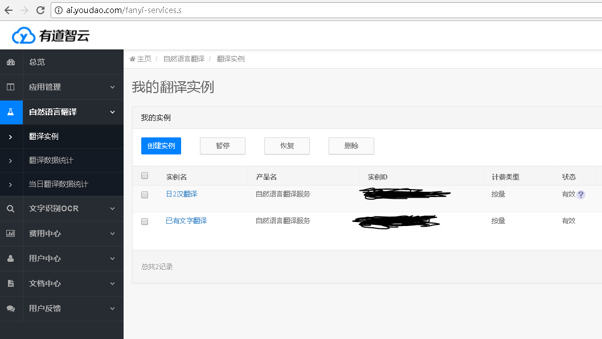
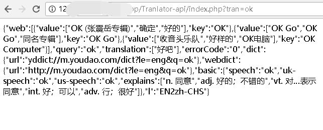
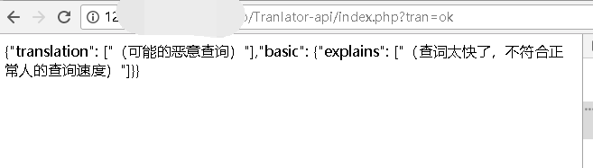
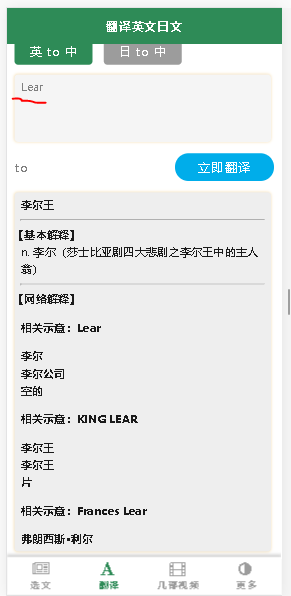

===有道翻译，PHP后端接口，Web前端，防恶意刷查，可以查询单词或者句子===

PHP有道翻译后端api制作，web前端请求词源示例与js解析json结果集。get方法请求，带防止恶意刷新查词。

 Youdao-translator writes the back end API by PHP, and the web front end requests the etymology sample and the JS to parse the JSON result set. The get method requests to prevent a malicious refresh of the word.

#
如果能帮助你的PHP后端或者Web前端技能的画，请给老铁一个免费的单击star。


#
#### [有道官网注册应用：](http://ai.youdao.com/fanyi-services.s)


#
####目录说明
|    【目录文件】     | 【描述】   |  
| --------   | -----  | 
| make_tran.php    | 关键文件，不用管  |  
| index.php       |   配置接口文件（密钥，互译对象，Get方式，防恶意查词函数）   |
| user_php_demo.php        |    web前端代码，查询，解析多种情况的Json    | 
| js_demo.html        |    js解析复杂json示例，不用管    | 


#
####在后端修改你的互译语言，并填写密钥
```php
//api例子：http://120.77.200.230/tp32app/tran/index.php?tran=ok 返回“ok”的查询json结果
$tran = $_GET["tran"] ;
//$tran = "He is Good!";
//调用翻译的规则：日文ja、英文EN、法文fr、韩文ko、简体汉语zh-CHS
translate($tran,"EN","zh-CHS");
```
####在前端编写查询源，并解析返回的json
```html
<!--开始-英汉翻译-->
<div class="tab-a-item">
	<!--查询元-->
	<!--输入域textarea在Android 下拉刷新时表现的不够优秀，所以替换成了div-->
	<div class="tran-texta en-res" id="en-res" contenteditable="true"></div>
	<div class="btn-go-zone"  oncontextmenu="return false" onselectstart="return false">
		<span class="tab-to-btn">to</span>
		<span class="tab-go-btn en-tran-btn click">立即翻译</span>
		<div class="clear"></div>
	</div>
	<div>
		<div class='en-alert' style='color: green;margin-bottom: 5px;font-size: 12px;'></div>
		<!--显示结果-->
		<div class="tran-sult-en tran-sult en-zh-sult" id="tran-sult"></div>
	</div>
</div>
<script>
    var tran_txt_en ;//取值校验
    $(".en-tran-btn").click(function(){
        var tran_txt = $(".en-res").text();//取值
        var tran_reslt = $(".en-zh-sult");//翻译结果显示区域
        var tran_url = "http://120.77.200.230/tp32app/tran/index.php?tran=" + tran_txt;//英译汉翻译接口
        $(".tran-sult-en").html(
            '                        <div class="tran-info-en"></div>' +
            '                        <hr />' +
            '                        <div class="exp-info-en">' +
            '                            <div style="margin-left: -10px;">【基本解释】</div>' +
            '                        </div>' +
            '                        <div class="web-info-en">' +
            '                            <div style="margin-left: -10px;">【网络解释】</div>' +
            '                        </div>');
        if (!tran_txt){
            tran_reslt.html("<span style='color: red;'>（英文翻译源为空）</span>");
        }else {

            //校验是否重复翻译，避免乱刷
            if (tran_txt_en === tran_txt){
                //连续重复查
                $(".en-alert").html("");
            }else {

                $(".en-alert").html("");
                tran_txt_en = $(".en-res").text();
                $.getJSON(tran_url, function(dataObj, status){
                    console.log(status);
                    //必选
                    $(".q-info-en").append("<h4>查询词："+dataObj.query+"</h4>");
                    //必选
                    for (m=0;m<dataObj.translation.length;m++) {
                        $(".tran-info-en").append("<div>"+dataObj.translation[m]+"</div>");
                    }
                    //非必。基本解释
                    if(typeof(dataObj.basic) === "undefined"){
                        console.log("你查询的是句子1");
                        $(".exp-info-en").hide();
                    }else{
                        for (j=0;j<dataObj.basic.explains.length;j++) {
                            $(".exp-info-en").append("<div style='font-weight: 500;'>"+dataObj.basic.explains[j]+"</div>");
                        }
                    }
                    //非必
                    $(".exp-info-en").append("<hr/>");
                    //非必。网络解释
                    if(typeof(dataObj.web) === "undefined"){
                        console.log("你查询的是句子2");
                        $(".web-info-en").hide();
                    }else{
                        for (i=0;i<dataObj.web.length;i++) {
                            $(".web-info-en").append("<p>相关示意："+dataObj.web[i].key+"</p>");
                            for (ii=0;ii<dataObj.web[i].value.length;ii++) {
                                $(".web-info-en").append("<div>"+dataObj.web[i].value[ii]+"</div>");
                            }
                        }
                    }
                });

            }
        }
    });
</script>
<!--结束-英汉翻译-->
```

#
#### 欣赏几张图
#####正常查询

#####防止恶意查询

#####查询结果图


